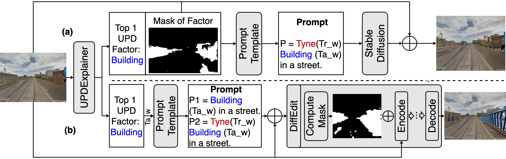

# URSimulator: Human-Perception-Driven Prompt Tuning for Enhanced Virtual Urban Renewal via Diffusion Models

This repository contains the datasets, prompts, and supplementary materials for the paper:
**"URSimulator: Human-Perception-Driven Prompt Tuning for Enhanced Virtual Urban Renewal via Diffusion Models"** 
by **Chuanbo Hu, Shan Jia, and Xin Li**.

---

## Abstract
Tackling Urban Physical Disorder (e.g., abandoned buildings, litter, messy vegetation, and graffiti) is essential, as it negatively impacts the safety, well-being, and psychological state of communities. Urban Renewal is the process of revitalizing these neglected and decayed areas within a city to improve their physical environment and quality of life for residents. Effective urban renewal efforts can transform these environments, enhancing their appeal and livability. However, current research lacks simulation tools that can quantitatively assess and visualize the impacts of urban renewal efforts, often relying on subjective judgments. Such simulation tools are essential for planning and implementing effective renewal strategies by providing a clear visualization of potential changes and their impacts. This paper presents a novel framework that addresses this gap by using human perception feedback to simulate the enhancement of street environment. We develop a prompt tuning approach that integrates text-driven Stable Diffusion with human perception feedback. This method iteratively edits local areas of street view images, aligning them more closely with human perceptions of beauty, liveliness, and safety. Our experiments show that this framework significantly improves people's perceptions of urban environments, with increases of 17.60% in safety, 31.15% in beauty, and 28.82% in liveliness. In comparison, other advanced text-driven image editing methods like DiffEdit only achieve improvements of 2.31% in safety, 11.87% in beauty, and 15.84% in liveliness. We applied this framework across various virtual scenarios, including neighborhood improvement, building redevelopment, green space expansion, and community garden creation. The results demonstrate its effectiveness in simulating urban renewal, offering valuable insights for real-world urban planning and policy-making. This method not only enhances the visual appeal of neglected urban areas but also serves as a powerful tool for city planners and policymakers, ultimately improving urban landscapes and the quality of life for residents.

---

## Example


---

## Framework


---

## Strategies


---

## Dataset

The sample dataset is available for download at the following link: 

Additional data may be added in the future.  

---

## Case Study


---


## Citation
If you use our data or prompts in your research, please cite our paper:
```text
@article{hu2024ursimulator,
  title={URSimulator: Human-Perception-Driven Prompt Tuning for Enhanced Virtual Urban Renewal via Diffusion Models},
  author={Hu, Chuanbo and Jia, Shan and Li, Xin},
  journal={arXiv preprint arXiv:2409.14589},
  year={2024}
}
```
